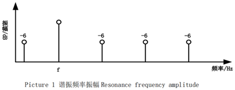
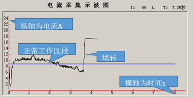

# ripple_detector
纹波检测~

| 纹波检测程序需求说明 |              |                                                              |
| -------------------- | ------------ | ------------------------------------------------------------ |
| 序                   | 项           | 具体要求                                                     |
| 1                    | 波形质量要求 |           1．纹波频率：（16±0.2）V下，电机纹波频率应≤1400Hz；          2．纹波振幅：（9±0.2）V下，纹波电流幅值≥0.4A（幅值），相邻二个纹波幅值的差值≤较大纹波幅值的 30%；             3．波形品质：（13.5±0.2）V下，参考纹波振幅（可以使用傅立叶变换来观察）：(基波频率fn)为0dB，则（一次谐波2fn）、（二次谐波3fn）和（三次谐波4fn），都需要在(基波频率fn)的-6dB    值之下，如下图： |
| 2                    | 名词解释     |       1，电动玻璃升降器的电机：一般是DC12V，扭矩3.5Nm，重卡有用DC24V电机的；          2，纹波：下图为典型的电动玻璃升降器电机运行电流曲线：可见电流除了直流部分，还有在直流电流值上下波动的交流部分，这个交流部分就是纹波信号。读取电动玻璃升降器的纹波信号主要用于防夹。当升降器运行受阻时直流电流会升高，继而影响纹波信号，因此可通过处理纹波信号来实现车窗防夹。 |
| 3                    | 纹波功能检测 | 按第3项标准逐一检测纹波功能，并判断是否合格                  |
| 4                    | 人机界面     | 正式运行时无界面要求（由升降器检测主程序来布置人机界面）     |
| 5                    | Demo版       | 应设计一个Demo版本用于程序验证，此时应模拟电压和电流数据，并用一个简单界面给出检测和判断结果 |

